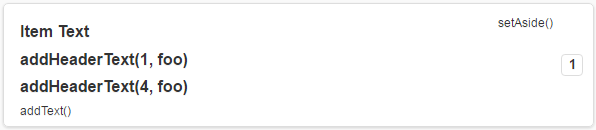

> # jqm4gwt #


* 官網：https://github.com/jqm4gwt/jqm4gwt
* repo：https://github.com/jqm4gwt/jqm4gwt


Component
=========

均使用預設的 CSS。


JQMList
-------

`clear()` 真的是全部清光光，items 跟 dividers 都要重新給。


JQMListItem
-----------



* `setImage()`、`setIcon()`、`setThumbnail()` 互斥。
	都有作 `setImage()`，但是分別有不一樣的 CSS class 設定。
	* `setIcon()` 的視覺效果好悽慘，這真的能用嗎？
* 如果所屬的 `JQMList` 做了 `list.getElement().addClassName("jqm4gwt-list-static-item-img-right");`：
	* `addSecondaryImage()` / `setSecondaryImage()` 會跟 `setCount()` 互斥。
	* 只有最後一個 secondary image 會出現在右邊


Project Setup
=============

官方文件有點殘缺，自己重寫一次...... ＝＝"

以下使用 standalone 的方式。

1. `pom.xml` 加入

	```XML
	<dependency>
		<groupId>com.sksamuel.jqm4gwt</groupId>
		<artifactId>jqm4gwt-standalone</artifactId>
		<version>1.4.6.Final</version>
		<scope>provided</scope>
	</dependency>
	<dependency>
		<groupId>com.sksamuel.jqm4gwt</groupId>
		<artifactId>jqm4gwt-library</artifactId>
		<version>1.4.6.Final</version>
	</dependency>
	```

	* 官方文件沒有特別註明要加 `jqm4gwt-library` 這個 dependency
	* `jqm4gwt-standalone` 一定要在 `jqm4gwt-library` 前面。
	
		> jqm4gwt-standalone must be the first in java build path order, before jqm4gwt-library
		
1. `foo.gwt.xml` 當中加入

	```XML
	<inherits name='com.sksamuel.Jqm4gwt' />
	```

1. （如果是後來才導入 jqm4gwt）清除 `/webapp/foo`
1. 跑一次 `mvn install`，這樣產生 `/foo` 目錄中才會出現 `css`、`js` 的目錄。
1. 把產生出來的 `/foo` 複製回 `/webapp/foo`


Host Page 調整
--------------

 ### head ###

解決 mobile device 上頭字體會超級小的問題：

```XML
<meta name="viewport" content="width=device-width, minimal-ui, initial-scale=1.0, user-scalable=no, minimum-scale=1.0, maximum-scale=1.0">
```


### body ###

解決 Safari 無法正常顯示（Chrome / Firefox 都沒問題）：

```XML
<div data-role="page" id="start"></div>
```
